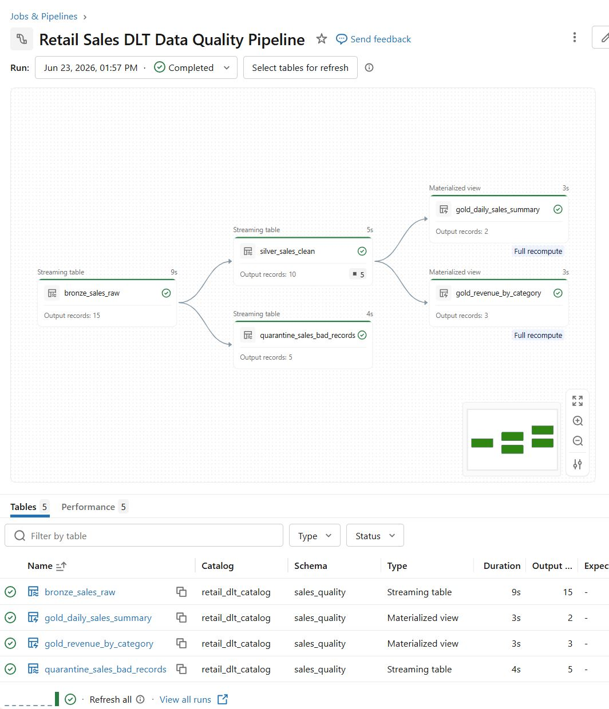
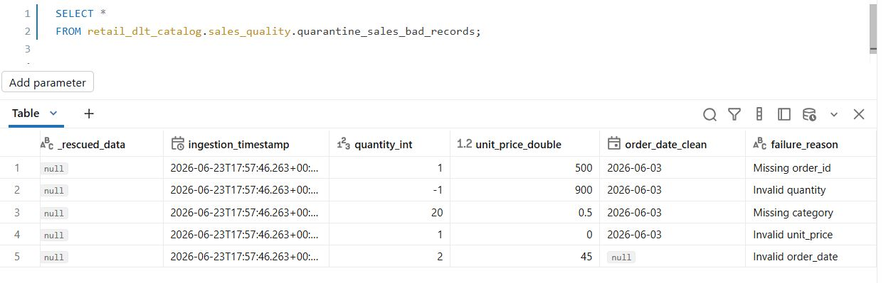
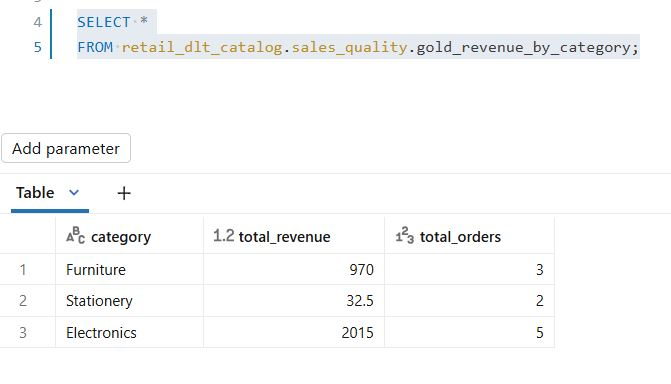
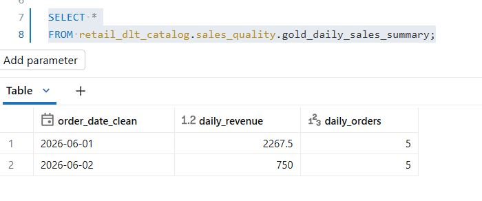

# Retail Sales Data Quality Pipeline using Lakeflow / Delta Live Tables

## Project Overview

This project builds a Databricks Lakeflow Declarative Pipelines / Delta Live Tables pipeline to process retail sales data using Medallion Architecture.

The pipeline ingests raw CSV files, validates data quality, separates invalid records into a quarantine table, and creates Gold-level business summary tables for reporting.

## Business Problem

Retail sales data can contain data quality issues such as missing order IDs, negative quantities, missing categories, zero prices, and invalid dates.

This project solves the problem by building an automated data pipeline that:

- Ingests raw sales files
- Cleans and validates records
- Captures bad records with failure reasons
- Produces business-ready revenue summary tables

## Architecture

```text
CSV Files in Unity Catalog Volume
        ↓
Bronze Table: bronze_sales_raw
        ↓
Silver Table: silver_sales_clean
        ↓
Quarantine Table: quarantine_sales_bad_records
        ↓
Gold Tables:
- gold_revenue_by_category
- gold_daily_sales_summary








